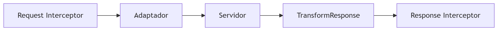

# <font color=#ff5733>Axios</font>

Axios es una librería cliente HTTP basada en Promesas, ampliamente usada en React para hacer peticiones a APIs. A diferencia de fetch, ofrece ventajas como:

- Interceptores (para manejar errores globalmente).
- Cancelación de peticiones.
- Transformación automática de datos JSON.
- Soporte para navegadores antiguos.

### Teoría Detrás de Axios: Fundamentos y Funcionamiento Interno


#### 🔷 1. Arquitectura de Axios

Axios se basa en un sistema modular con estos componentes esenciales:

**A. Core**

- Adaptadores:
    - Usa XMLHttpRequest en navegadores y http en Node.js.
    - Intercambiable (puedes implementar tu propio adaptador).
- Interceptores:
    - Middleware para modificar requests/responses globalmente.

```js
axios.interceptors.request.use(config => {
  config.headers.Authorization = 'Bearer token';
  return config;
});
```

- Gestión de Promesas:
    - Convierte callbacks en Promesas para mejor manejo asíncrono.

**B. Capa de Transformación**

- Transformación automática de datos:
    - Convierte JSON a objetos JS sin necesidad de .json() (como en Fetch).
    - Soporta transformación manual con transformRequest/transformResponse.

```js
axios({
  transformResponse: [
    (data) => JSON.parse(data).customFormat, // Transformación personalizada
  ],
});
```

**C. Gestión de Errores**

- Estructura unificada de errores:
    - Detecta errores de red (4xx/5xx) y los normaliza en un objeto estándar:

```js
{
  message: "Request failed with status code 404",
  config: {...},  // Configuración de la petición
  response: { data: {}, status: 404 }, // Respuesta del servidor
  isAxiosError: true
}
```

#### 🔷 2. Flujo de una Petición Axios

1. Interceptores de Request:

    - Modifican la configuración antes de enviar (ej: añadir headers).

2. Adaptador:

    - Decide si usa XHR (navegador) o http (Node.js).

3. Transformación de Request:

    - Serializa datos (ej: objetos → JSON).

4. Respuesta del Servidor:

    - Recibe datos en crudo.

5. Transformación de Response:

    - Parsea JSON o aplica transformaciones personalizadas.

6. Interceptores de Response:

    - Manejo global de errores o datos.



#### 🔷 3. Cancelación de Peticiones

Axios implementa el enfoque AbortController, al igual que Fetch, para evitar "memory leaks" en componentes desmontados:

```js
const controller = new AbortController();

axios.get('/api/data', { signal: controller.signal })
  .catch(error => {
    if (error.name === 'AbortError') {
      console.log('Petición abortada');
    }
  });

// Aborta la petición
controller.abort();
```

#### 🔷 4. Teoría de Interceptores

Los interceptores actúan como middleware en el ciclo de vida de una petición, siguiendo el patrón Chain of Responsibility:

```js
// Request Interceptor
axios.interceptors.request.use(
  (config) => {
    console.log('Request enviada:', config.url);
    return config; // Debe devolver la configuración modificada
  },
  (error) => Promise.reject(error)
);

// Response Interceptor
axios.interceptors.response.use(
  (response) => {
    console.log('Response recibida:', response.status);
    return response; // Devuelve la respuesta modificada
  },
  (error) => {
    if (error.response.status === 401) {
      localStorage.removeItem('token');
    }
    return Promise.reject(error);
  }
);
```

#### 🔷 5. Gestión de Concurrencia

Axios incluye métodos para manejar múltiples peticiones simultáneas:

**`axios.all()` + `axios.spread()`**

```js
const [users, posts] = await axios.all([
  axios.get('/api/users'),
  axios.get('/api/posts'),
]);

// Equivalente con Promise.all:
const [users, posts] = await Promise.all([...]);
```

### Uso Básico con React

#### Petición GET (Ejemplo en un componente)

```js
import axios from 'axios';
import { useEffect, useState } from 'react';

function UserList() {
  const [users, setUsers] = useState([]);

  useEffect(() => {
    axios.get('https://jsonplaceholder.typicode.com/users')
      .then((response) => setUsers(response.data))
      .catch((error) => console.error("Error fetching users:", error));
  }, []);

  return (
    <ul>
      {users.map((user) => (
        <li key={user.id}>{user.name}</li>
      ))}
    </ul>
  );
}
```

#### Petición POST (Ejemplo con formulario)

```js
function AddPost() {
  const [title, setTitle] = useState('');

  const handleSubmit = async (e) => {
    e.preventDefault();
    try {
      await axios.post('https://jsonplaceholder.typicode.com/posts', { title });
      alert('Post creado!');
    } catch (error) {
      console.error("Error al crear post:", error);
    }
  };

  return (
    <form onSubmit={handleSubmit}>
      <input 
        value={title} 
        onChange={(e) => setTitle(e.target.value)} 
      />
      <button type="submit">Enviar</button>
    </form>
  );
}
```

### Axios + React Router v7 (Integración Avanzada)

#### Usando loader para cargar datos antes de renderizar

En React Router v7, puedes usar Axios dentro de un loader para precargar datos antes de mostrar la ruta:

```js
import { createBrowserRouter, RouterProvider } from 'react-router-dom';

const router = createBrowserRouter([
  {
    path: '/posts',
    element: <PostsPage />,
    loader: async () => {
      const response = await axios.get('/api/posts');
      return response.data; // Los datos estarán disponibles en useLoaderData()
    },
  },
]);

function PostsPage() {
  const posts = useLoaderData(); // <- Datos cargados por el loader
  return (
    <div>
      {posts.map((post) => (
        <div key={post.id}>{post.title}</div>
      ))}
    </div>
  );
}
```

#### Usando action para enviar datos (POST/PUT/DELETE)

```js
{
  path: '/posts/new',
  element: <NewPost />,
  action: async ({ request }) => {
    const formData = await request.formData();
    const response = await axios.post('/api/posts', Object.fromEntries(formData));
    return redirect('/posts'); // Redirige después del éxito
  },
}
```

### Mejores Prácticas con Axios

#### Crear una instancia reutilizable

```js
// src/api/axios.js
import axios from 'axios';

export const api = axios.create({
  baseURL: 'https://api.example.com',
  timeout: 5000,
  headers: { 'Authorization': 'Bearer token' },
});
```

#### Interceptores (manejo global de errores)

```js
api.interceptors.response.use(
  (response) => response,
  (error) => {
    if (error.response.status === 401) {
      window.location.href = '/login'; // Redirige si no está autenticado
    }
    return Promise.reject(error);
  }
);
```

#### Cancelación de peticiones (evitar memory leaks)

```js
useEffect(() => {
  const source = axios.CancelToken.source();

  axios.get('/api/data', { cancelToken: source.token })
    .then((response) => setData(response.data))
    .catch((error) => {
      if (axios.isCancel(error)) {
        console.log('Petición cancelada');
      }
    });

  return () => source.cancel(); // Cancela al desmontar el componente
}, []);
```

### Axios vs Fetch nativo

| Característica | Axios | Fetch |
|------|------|------|
| Soporte navegadores |	Más amplio (IE11+) | Modernos (necesita polyfill) |
| Transformación JSON |	Automática | Manual (response.json()) |
| Interceptores | Sí | No |
| Cancelación | Sí (AbortController) | Sí (AbortController) |
| Progreso de carga	| Sí | No |