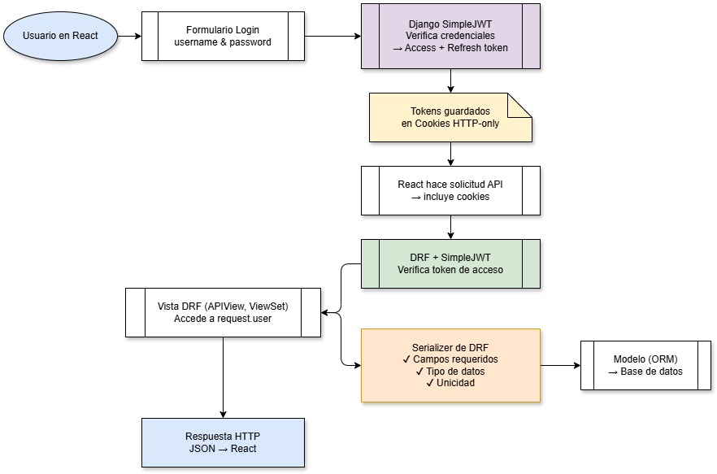

Este proyecto es una aplicación web construida con Django, React y MySQL, diseñada para gestionar pedidos de notas de venta previamente generadas en un sistema ERP externo. Además, es posible hacer pedidos de picking para el correcto despacho y retiro de productos, hacer pedidos de materias primas e insumos a los encargados de esa área, guardar facturas para su posterior visualizacion o descarga y asignar los dias sábados trabajados al personal de la empresa. Su propósito es proporcionar una interfaz amigable y eficiente para realizar solicitudes de pedidos, visualizar estadísticas relevantes mediante un dashboard y consultar registros históricos y pendientes.

### Tecnologías utilizadas

#### Backend

- Django como framework principal.
- Django REST Framework (DRF) para la creación de una API RESTful.
- Autenticación con JWT utilizando cookies HTTP-only para mayor seguridad.
- MySQL como base de datos relacional.

#### Frontend

- React para la construcción de la interfaz de usuario.
- Redux Toolkit para el manejo eficiente del estado global.
- React Router para la navegación entre páginas protegidas y públicas.
- Material UI (MUI) para una interfaz moderna, accesible y responsiva.

### Funcionalidades principales

- Gestión de pedidos: Formulario, visualización, actualización e históricos
- Gestión de Materias Primas: Formulario, visualización, actualización e históricos
- Gestión de Picking: Formulario, visualización, actualización e históricos
- Guardado de facturas: Facturas pendientes de pago e históricas, visualización y descarga
- Gestión días sábados: Asignación mensual de días a cada trabajador e históricos

Este sistema ofrece una solución eficiente para complementar un ERP ya existente, mejorando el flujo de trabajo en la gestión de pedidos y proporcionando herramientas visuales para su seguimiento.

### Diagrama de Flujo Software

---