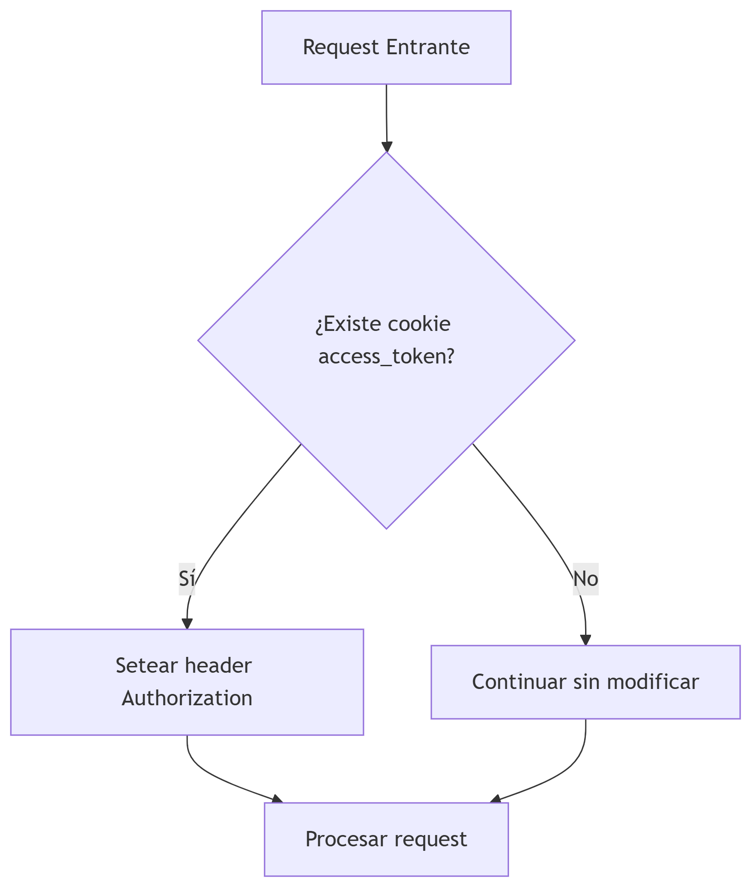

# Archivo `middleware.py`

Está diseñado para integrar tokens JWT almacenados en cookies con el sistema de autenticación de Django REST Framework, moviendo el token desde las cookies a los headers de autorización.

```python
class JWTTokenFromCookieMiddleware:
    def __init__(self, get_response):
        self.get_response = get_response

    def __call__(self, request):
        token = request.COOKIES.get('access_token')
        if token:
            request.META['HTTP_AUTHORIZATION'] = f'Bearer {token}'
        return self.get_response(request)
```

### Funcionamiento Detallado

| Componente | Función |
|------|---|
| \__init__ |	Inicializa el middleware con get_response (patrón estándar de Django)
| \__call__ | Intercepta cada request para procesar el token
| request.COOKIES.get('access_token') | Obtiene el token JWT de las cookies
| request.META['HTTP_AUTHORIZATION'] | Establece el header de autorización

### Configuración Requerida

- Agregar a settings.py:

```python
MIDDLEWARE = [
    ...
    'path.to.JWTTokenFromCookieMiddleware',
    ...
]
```

- Requisitos del Frontend:

    - El cliente debe almacenar el token JWT en una cookie llamada access_token
    - La cookie debe enviarse con cada request (HttpOnly + Secure recomendado)

### Consideraciones de Seguridad

|Buenas Prácticas | Riesgos
|------|------|
|Usar cookies HttpOnly |	Exposición a XSS si no es HttpOnly
|Habilitar Secure flag (HTTPS) | Intercepción en conexiones no cifradas
|Implementar CSRF protection | Ataques CSRF si no se maneja correctamente

### Diagrama de Flujo



### Casos de Uso Recomendados

- Aplicaciones SPA (React, Vue, Angular) con autenticación JWT
- Implementaciones donde el almacenamiento en cookies es preferible a localStorage
- Sistemas que requieren compatibilidad con protección CSRF

### Limitaciones

- No maneja renovación automática de tokens
- Depende de que el frontend gestione correctamente las cookies
- No incluye mecanismos de fallback para otros métodos de autenticación

---
